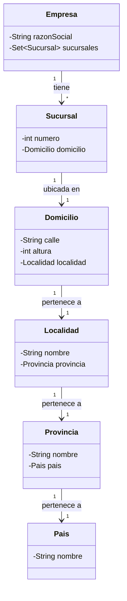

# 🏢 Modelado de Empresas y Sucursales (Traza 1)


> **Ejercicio Práctico - Traza 1**
> Implementación de un modelo de dominio basado en UML, enfocado en el manejo de relaciones, cardinalidad y colecciones sin duplicados.

---

## 📋 Descripción del Ejercicio

Este proyecto consiste en la implementación en Java de un modelo de objetos que representa la estructura geográfica y organizacional de Empresas y sus Sucursales.

El objetivo principal es traducir un diagrama UML a código, respetando los principios de la Programación Orientada a Objetos, específicamente el **encapsulamiento** y la correcta definición de **relaciones** (Asociación, Composición/Agregación).

### 🛠 Requerimientos Técnicos Clave
* **Colecciones:** Se utiliza estrictamente `HashSet` para manejar las multiplicidades, garantizando la unicidad de los elementos.
* **Relaciones:** Implementación unidireccional o bidireccional según corresponda la lógica de negocio.
* **Identidad de Objetos:** Correcta implementación de `equals()` y `hashCode()` para el funcionamiento del `HashSet`.

---

## 🏗 Arquitectura del Modelo

El sistema modela una jerarquía geográfica que culmina en la ubicación de una sucursal.



---

## 🚀 Escenario de Ejecución (`Main`)

La clase principal ejecuta una secuencia predefinida de carga de datos para probar la integridad del modelo:

1. **Carga Geográfica:**
* Creación de **País** (Argentina).
* Creación de **Provincias** (Buenos Aires, Córdoba).
* Creación de **Localidades** (CABA, La Plata, Córdoba Capital, Villa Carlos Paz).
* Creación de **Domicilios** específicos para cada localidad.


2. **Carga Organizacional:**
* Creación de 4 **Sucursales**, asignándoles los domicilios creados previamente.
* Creación de 2 **Empresas** y asignación de sus respectivas sucursales.


---

## ⚙️ Funcionalidades Implementadas

El programa permite realizar las siguientes operaciones sobre las empresas cargadas:

| Operación | Descripción |
| --- | --- |
| **Listar Todo** | Muestra todas las empresas con sus detalles y sucursales anidadas. |
| **Buscar por ID** | Recupera una empresa específica mediante su identificador único. |
| **Buscar por Nombre** | Filtra y encuentra empresas por su Razón Social o nombre de fantasía. |
| **Actualizar** | Busca una empresa por ID y permite modificar sus datos (ej: CUIT/CUIL). |
| **Eliminar** | Remueve una empresa de la colección principal buscando por su ID. |

---

## 📦 Instrucciones de Ejecución

1. **Clonar el repositorio:**
```bash
git clone https://github.com/CamilaBastian/Traza1_Camila_Bastian.git

```


2. **Importar el proyecto:**
Abrir en IntelliJ IDEA, Eclipse o NetBeans como proyecto Java estándar.
3. **Ejecutar:**
Correr la clase `Main.java`. Verás en la consola la traza de la creación de objetos y los resultados de las operaciones de búsqueda y modificación.

---

## 👤 Autor

**Camila Bastian**
*Desarrolladora de Software*

